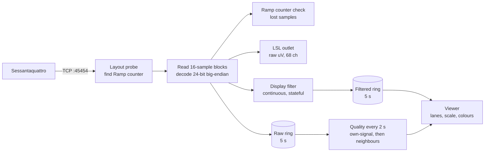

# sessantaquattro-eeg-lsl-toolkit

Stream a 64-channel **OT Bioelettronica Sessantaquattro** to [Lab Streaming Layer](https://labstreaminglayer.org) (LSL), with a live viewer that scores the contact quality of every electrode.

- **Raw stream to LSL** in microvolts, with real electrode labels and 3-D positions in the stream metadata, so a recording opens in MNE or EEGLAB with its montage attached.
- **A live viewer** showing 16 channels per page. Each trace stays in its own row however noisy it is. Badly contacted channels are greyed out, and each channel has a quality percentage.
- **Contact quality you can watch while gelling.** Each electrode is judged on its own signal, so channels turn green one at a time as you apply gel, even when most of the cap is still dry.
- **Data integrity checks.** It confirms the stream layout on connect, detects samples lost on the wireless link, and warns when there is no head under the cap.

---

## Contents
- [Requirements](#requirements)
- [Quick start](#quick-start)
- [Using the viewer](#using-the-viewer)
- [How quality is scored](#how-quality-is-scored)
- [The LSL stream](#the-lsl-stream)
- [Configuration](#configuration)
- [How it works](#how-it-works)
- [Project layout](#project-layout)
- [Troubleshooting](#troubleshooting)
- [Companion tools](#companion-tools)
- [Known limitations](#known-limitations)
- [References](#references)

---

## Requirements
| | Version | Needed for |
|---|---|---|
| Python | 3.8+ | |
| numpy | 1.21+ | |
| scipy | 1.8+ | filtering, spectra |
| matplotlib | 3.5+ | the viewer (needs an interactive backend, e.g. TkAgg or QtAgg) |
| pylsl | 1.16+ | the LSL outlet |
| mne | 1.0+ | *optional*: electrode positions for the stream metadata and the neighbour-based quality checks |

```bash
pip install -r requirements.txt
```

`pylsl` bundles the LSL library on Windows and macOS. On Linux, if `pylsl` cannot find `liblsl`, install it with `conda install -c conda-forge liblsl`.

Hardware: a Sessantaquattro with a 64-channel EEG cap connected in **monopolar** mode. The cap used during development was ELSCH064EEG on the ADEEGCap64SE adapter.

---

## Quick start

1. **Put the computer and the Sessantaquattro on the same Wi-Fi network.** The computer acts as the server: it listens on **TCP port 45454** and the device connects to it (this is also how OT Bioelettronica's reference code works). On Windows, allow Python through the firewall for incoming connections the first time it asks.

2. **Start the viewer from a terminal:**
   ```bash
   python main.py
   ```
   Run it from a terminal, not a notebook, Spyder or VS Code's interactive window. Those use a non-interactive plot backend, so the window won't respond to clicks or keys, and the viewer warns about this at startup.

3. **Turn on / connect the Sessantaquattro.** A healthy start looks like:
   ```
   Waiting for Sessantaquattro connection...
   Connected from: ('192.168.1.2', 50231)
   Start command sent.
   Probing stream layout (expecting 68 channels)...
     Confirmed: 68 channels, Ramp counter on index 67.
     neighbour map: 8 nearest electrodes per channel (e.g. Fp1 -> AF3, AF7, Fpz, AFz, F7, Fp2, F3, AF4)
   LSL outlet 'Sessantaquattro' created (68 ch, 64 EEG, 500 Hz, 24-bit, 0.286000 uV/bit).
   Streaming to LSL + viewer...
   HEAD CHECK: EEG structure present (r = +0.55)
   ```

4. **Record** with [LabRecorder](https://github.com/labstreaminglayer/App-LabRecorder): select the `Sessantaquattro` stream (type `EEG`) and start recording. The viewer only displays; recording is LabRecorder's job.

Closing the viewer window sends the stop command to the device and closes the connection.

---

## Using the viewer

### Controls
Every action has an on-screen button. Keys work too, once you've clicked on the plot to give it focus.

| Button | Keys | Action |
|---|---|---|
| `< Prev` / `Next >` | `←` `→` `↑` `↓`, `PgUp` `PgDn`, `p`/`n`, `k`/`j`, `Space`, mouse wheel | Previous / next page of 16 channels |
| | `Home` / `End` | First / last page |
| `Zoom +` / `Zoom -` | `+` / `-` | Scale traces up / down (×1.3 per step) |
| `Auto` | `a` | Toggle automatic scaling |
| `Reset` | `0` | Reset zoom to 1× |
| `Quality` | `q` | Print a full per-channel quality table to the terminal |
| | `c` | Toggle keeping each trace inside its own row (default on) |

### Reading the screen

| Element | Meaning |
|---|---|
| **Title bar** | Page, channel range, µV per row, AUTO/MANUAL scaling, lost-sample count (only shown if samples were lost), and `head r` (see [cap-level checks](#cap-level-checks)) |
| **Scale bar** (bottom left) | The height of one row, in µV |
| **Percentage** beside each channel | Contact quality: **green ≥ 70**, **orange 40–69**, **red < 40**. Updated every 2 s for all 64 channels |
| **Grey trace + `CLIP`** | The channel keeps hitting the edge of its row **and** scores below 40%: a bad contact. A good channel that briefly clips (a blink on a gelled frontal electrode) keeps its colour |
| **Amber banner** | Fewer than 8 channels are well contacted, so cap-level checks are not running yet (normal while gelling) |
| **Red banner** | `NO HEAD SIGNAL`: enough channels look clean on their own, but together they show none of the spatial structure a head produces (an empty cap, or a disconnected reference/ground) |
| **Dark banner + `COPY`** | `N CHANNELS ARE IDENTICAL COPIES`: those channels have the same offset and the same signal, so they are not touching the scalp (or are bridged together). They score 0% and are grey. They would otherwise look perfect: normal amplitude, no mains (see [identical copies](#identical-copies)) |
| **Purple banner + `REF`** | `CHECK REFERENCE / GROUND`: no channel on the cap is free of mains, and the channels that look like EEG all carry the same mains. It is coming in through the shared reference or ground electrode, so re-gelling the channels won't help. The `REF` channels keep their colour and set the display scale, so their EEG stays visible (see [reference / ground check](#reference--ground-check)) |

The display is filtered 1–45 Hz with notches at the mains frequency and its first harmonic, for viewing only. **The LSL stream is never filtered.** The display scale follows the well-contacted channels, so good EEG fills its row and poor channels clip against the edges.


---

## How quality is scored

Each channel's percentage is the **lowest** of its sub-scores, so one serious problem can't be hidden by good results elsewhere. Every channel is first judged on **its own signal**, without reference to the other channels. Cross-channel checks are added only when enough channels are well contacted to compare against.

### Per-channel sub-scores (5-second window)

| Sub-score | Measures | Full marks | Zero |
|---|---|---|---|
| **amp** | Typical amplitude: robust SD (1.4826 × MAD) of the 1–45 Hz signal. Blinks barely move it; continuous noise does | 3–50 µV | ≤ 1 µV or ≥ 150 µV |
| **line** | Mains pickup, both **absolute** and **relative to the channel's EEG** (the worse of the two) | ≤ 30 µV and ≤ 1× EEG | ≥ 300 µV or ≥ 10× EEG |
| **hf** | 40–100 Hz power, with the mains band removed, relative to 0.5–40 Hz power (muscle, broadband noise) | ≤ 0.35 | ≥ 1.5 |
| **corr** | Agreement with neighbouring electrodes (below). Only computed when possible | see below | |

Any sample within 5% of full scale scores 0 (clipping at the amplifier).

**Mains is the strongest contact indicator.** It rises steeply with electrode impedance. On a real partial-gel recording, gelled electrodes carried 19–26 µV of 60 Hz while dry ones carried 5,000–8,000 µV. The `Quality` table prints each channel's mains level, so while gelling, aim for under about 30 µV.

### Neighbour correlation

On a head, activity spreads through the scalp, so neighbouring electrodes agree. For each channel, the viewer compares its signal with up to 8 **well-contacted** electrodes among its 12 nearest. "Well contacted" means an own-signal score of at least 60. The comparison uses the 75th percentile of those correlations, after re-referencing to the average of the well-contacted channels. That removes whatever the single common reference electrode puts on every channel, which would otherwise make even an empty cap look well correlated.

A channel is marked down only if it is **both** unusual among its peers **and** poorly correlated in absolute terms (r below 0.55, zero at 0.30). Clear anti-correlation (r < −0.3) scores zero: an inverted or mis-referenced channel. A channel with fewer than 3 well-contacted neighbours is **not assessed**, rather than failed.

### Cap-level checks

| Well-contacted channels | Neighbour r (median, smoothed over ~10 s) | State |
|---|---|---|
| fewer than 8 | — | **insufficient**: amber banner; channels judged on their own signals only |
| 8 or more | ≥ 0.35 | **ok**: `head r` shown in the title bar |
| 8 or more | < 0.35 | **NO HEAD SIGNAL**: red banner; every channel that hasn't shown real neighbour agreement is scaled toward 0 |

Measured values: a real head gave +0.62 to +0.92 in every 5-second window; simulated empty caps gave +0.03 to +0.18.

### Identical copies

Every real electrode has its own offset (its half-cell potential, tens to hundreds of mV) and its own noise, so two real channels never match to the microvolt. Inputs that are not touching the scalp all report the same point inside the amplifier: the same offset and the same signal. That signal is small, has no mains and even has an alpha peak (most likely the reference electrode's own signal), so on its own every check passes. Copies also "agree with their neighbours" at r = 1.00, which used to make the head check pass on them.

In each window the viewer joins channels into a group when their offsets are within 2 mV **and** the RMS of their difference above 1 Hz is below 2.5 µV. Groups of 3 or more are copies. Channels at the group's exact offset join it too, even if a little signal leaks onto them. Copies score 0, are drawn grey with `COPY`, are left out of the neighbour, head and reference checks, and never set the display scale.

### Reference / ground check

Every channel is recorded against one shared reference electrode. Mains picked up there appears, identically, on every channel, so the per-channel scores all fall to 0% however well the channels are gelled. The viewer recognises the pattern in each window:

1. **No channel on the cap has less than 75 µV of mains.** A single channel with low mains proves the reference is fine, because the reference's mains would be on it too. Good sessions measured 4–20 µV here.
2. **At least 3 channels with EEG-sized signals** (amplitude sub-score ≥ 60) sit within 3× that lowest level, with similar mains (90th/10th percentile ≤ 2.5×).
3. **Their 60 Hz waveforms match** (median correlation ≥ 0.9). Only channels in step with the rest are listed.

The banner follows the majority of the last three checks (about 6 s). Separate poor contacts give mains of very different sizes and fail step 2 or 3. In a real session with a poorly attached reference, 8 freshly gelled central channels carried 300–550 µV of 60 Hz with waveform correlation 1.00, while the same electrodes in an earlier session carried about 19 µV.

Per-channel scores are **not** raised: the recorded data really does contain that mains. The check tells you where to fix it.

---

## The LSL stream

| Property | Value |
|---|---|
| Name / type | `Sessantaquattro` / `EEG` |
| source_id | `sessantaquattro_64ch` |
| Channels | **68**: 64 EEG, then `AUX1`, `AUX2`, `BufferChannel`, `RampChannel` |
| Rate / format | 500 Hz, `float32`, pushed in chunks of 16 samples |
| EEG units | **microvolts**, raw: DC-coupled, unfiltered, not re-referenced |
| Other channels | raw device counts (unit `raw`, type `Misc`) |
| Timestamps | LSL `local_clock()` at the arrival of each chunk; use LabRecorder / pyxdf dejittering |

**Metadata** (`desc`): per channel `label`, `unit`, `type`, and, when `mne` is installed, `location` X/Y/Z from the standard 10-05 template. Under `acquisition`: manufacturer, model, `resolution_bits` and `lsb_microvolts`.

**The DC offset is real.** The amplifier is DC-coupled, so every EEG channel carries its electrode's offset (typically tens to hundreds of mV). High-pass filter at analysis time. `float32` still resolves finer than one ADC step across the whole ±2.4 V input range, so carrying the offset costs no precision.

**`RampChannel`** is the device's 16-bit sample counter. It is the only way to detect samples lost on the wireless link, because LSL timestamps simply re-time the stream. A clean recording steps by exactly +1 every sample, wrapping from 65535 to 0.

---

## Configuration

All settings are constants near the top of `sq_lsl_viewer.py`.

| Setting | Default | Notes |
|---|---|---|
| `CHANNEL_LABELS` | 64 labels, Fp1 … O2 | **Device pin order**, read from an OTBioLab+ recording of this cap. Set to `None` for `EEG1…EEG64`. Use `extract_otb_montage.py` for a different cap |
| `host`, `port` | `"0.0.0.0"`, `45454` | Where the computer listens for the device |
| `RESOLUTION_BITS` | `24` | Same 0.286 µV per count either way; the extra byte adds **range**. 24-bit covers ±2.4 V. 16-bit covers only ±9.4 mV, and with the amplifier DC-coupled (`HPF = 0`), electrode offsets of tens to hundreds of mV put **every channel at the rail**. Use 16-bit only with the hardware high-pass on |
| `line_freq` | `60.0` | Mains frequency: **50** in eastern Japan, Europe and most of Asia; 60 in western Japan and the Americas. `analyze_eeg.py` detects it from a recording |
| `window_sec` | `5` | Seconds on screen and per quality window |
| `channels_per_page` | `16` | Rows per page |
| `disp_hp_hz`, `disp_lp_hz` | `1.0`, `45.0` | Display filter band (display only) |
| `good_rms_uv`, `amp_zero_uv` | `(3, 50)`, `(1, 150)` | Amplitude sub-score |
| `mains_abs_ok`, `mains_abs_bad` | `30`, `300` µV | Absolute mains sub-score |
| `line_ratio_ok`, `line_ratio_bad` | `1`, `10` | Mains relative to EEG |
| `hf_ratio_ok`, `hf_ratio_bad` | `0.35`, `1.5` | High-frequency sub-score |
| `trust_min` | `60` | Own-signal score for a channel to count as well contacted |
| `head_min_trusted` | `8` | Well-contacted channels needed for cap-level checks |
| `head_r_min` | `0.35` | Neighbour correlation needed to report a head |
| `corr_k`, `corr_reach` | `8`, `12` | Neighbours compared, among how many nearest |
| `copy_dc_tol_uv`, `copy_rms_uv`, `copy_min_channels` | `2000` µV, `2.5` µV, `3` | Identical-copy check |
| `ref_floor_uv`, `ref_group_span`, `ref_similar`, `ref_min_channels`, `ref_coherence` | `75`, `3`, `2.5`, `3`, `0.9` | Reference / ground check |

### Device command

`create_bin_command()` builds the 2-byte command word. Field meanings follow OT Bioelettronica's reference script:

| Field | Value used | Meaning |
|---|---|---|
| GO | 1 | Send settings and start transfer (0 on exit = stop) |
| REC | 0 | Don't record to the device's SD card |
| TRIG | 0 | Transfer controlled remotely by this command |
| EXTEN | 0 | Standard input range. **Keep 0**: ×2/×4/×8 ranges change the µV scaling |
| HPF | 0 | DC coupled (hardware high-pass off) |
| HRES | 1 | 24-bit samples (from `RESOLUTION_BITS`) |
| MODE | 0 | Monopolar (6 = impedance check, 7 = test mode) |
| NCH | 3 | 64 channels |
| FSAMP | 0 | 500 Hz (1 = 1000, 2 = 2000) |

With these settings the command is `0x1881`.

---

## How it works



- **Layout probe.** On connect, the viewer reads about 50 samples and finds the channel count at which one column advances by exactly +1 per sample: the Ramp counter. A wrong channel count shifts every sample boundary, turning each "channel" into a rotating mixture of inputs, and this is invisible on flat data. The probe makes it impossible. If the device sends a different count, the viewer adapts and says so.
- **Decoding.** Big-endian, two's complement for EEG and AUX; unsigned for Buffer and Ramp. EEG is multiplied by **0.286 µV per count**.
- **Display filter.** Runs continuously in the acquisition thread with its state carried between blocks. Re-filtering each 5-second window from scratch makes the filter ring at both ends of the window, and with a DC-coupled amplifier those edge artefacts swamp the plot.
- **Threads.** Acquisition, decoding, LSL output and filtering run in a background thread. Only drawing and quality scoring run on the main thread.

---

## Project layout

```
main.py (entry point: connect, probe the layout, start the LSL outlet, thread and viewer)
sqlsl/
  config.py (all settings: labels, host/port, display, quality thresholds)
  protocol.py (device command word, µV-per-count scale, disconnect)
  runtime.py (shared state: channel layout, ring buffers, lock, stop flag)
  decoding.py (socket reads, 24/16-bit decoding, channel-count probe)
  counter.py (Ramp counter / dropout monitor)
  filters.py (display filters (live causal + zero-phase for analysis))
  montage.py (electrode positions, nearest-neighbour map)
  outlet.py (LSL outlet and its metadata)
  quality.py (per-channel own-signal scores (amp, line, hf))
  cap_checks.py (neighbour correlation, head check, identical copies, reference check)
  report.py (the printed quality table (`Quality` / `q`))
  acquisition.py (background acquisition thread)
  viewer.py (matplotlib viewer)
```

The `sqlsl` modules can be imported on their own, for example to score a recording offline:

```python
from sqlsl.cap_checks import assess_cap
overall, parts, r, cap = assess_cap(eeg_window_uv)  # (samples, 64) in µV, 500 Hz
```

Values that change when the device reports a different channel count (`nch`, `n_eeg`, `eeg_labels`, the ring buffers) live in `sqlsl/runtime.py`. Read them as `runtime.nch`, not `from sqlsl.runtime import nch`, or the copy goes stale after the layout probe adjusts them.

---

## Troubleshooting

| Symptom | Cause / fix |
|---|---|
| Stuck at `Waiting for Sessantaquattro connection...` | The device isn't reaching the computer. Check both are on the same network, the firewall allows Python on port 45454, and no other program (e.g. OTBioLab+) is connected to the device; it serves one client at a time |
| Connected, but no data | Press the Sessantaquattro pushbutton; check the device mode |
| `could not find the Ramp counter` warning | The layout couldn't be confirmed. Treat the traces with suspicion and check the device mode (monopolar, 64 ch) |
| `DROPOUT: n sample(s) lost` | The Wi-Fi link dropped samples. Move the computer closer, reduce 2.4 GHz congestion |
| Keys / buttons do nothing | Non-interactive plot backend. Run from a terminal (see Quick start) |
| All channels in colour but a red `NO HEAD SIGNAL` banner | Cap not on a head, or the reference/ground electrode is disconnected |
| Mains appears on every channel, even gelled ones | Check the reference and ground electrodes first; every channel is measured against them |
| Dark `IDENTICAL COPIES` banner, many channels grey with `COPY` | Those electrodes aren't touching the scalp: cap lifted, hair under the electrodes, or not gelled at all. If it covers a whole connector's channels, check that the connector is seated |
| Real EEG looks like square steps | The traces are being cut at the edge of their row because the scale is too small. Press `-` or `a` |
| Purple `CHECK REFERENCE / GROUND` banner, or mains on every channel even gelled ones | Re-attach the reference and ground electrodes first: clean the skin, fresh gel, firm contact, leads seated. Every channel is measured against them |
| Traces look like flat lines | Zoom in (`+`); in MANUAL mode press `a` to restore auto-scaling |

---

## Companion tools

coming soon

---

## Known limitations

- **Quality is inferred from the signal, not measured.** It is not an impedance measurement. The device has an impedance-check mode (`MODE = 6`), which the viewer does not decode; use OTBioLab+ or OT Bioelettronica's impedance script for true impedances.
- **Intermittent pops can pass the live score.** The amplitude measure ignores rare large events so that blinks don't fail good frontal electrodes, which also lets an electrode with occasional pops through. The neighbour check catches it once 8 channels are good, and `analyze_eeg.py` flags it over a whole recording.
- **Thresholds were tuned on one cap in one lab** (60 Hz mains). Absolute mains limits in particular depend on the environment.
- **Monopolar 64-channel mode only.** Other modes change the channel count and are not handled.
- **One device per instance**, on a fixed port.

---

## References

- OT Bioelettronica reference code: [OTB-Matlab](https://github.com/OTBioelettronica/OTB-Matlab) (`Sessantaquattro MatLab/Read_sessantaquattro.m`: command fields, 68-channel layout, `ConvFact = 0.000286` mV) and [OTB-Python](https://github.com/OTBioelettronica/OTB-Python)
- [Lab Streaming Layer](https://labstreaminglayer.org) · [pylsl](https://github.com/labstreaminglayer/pylsl) · [LabRecorder](https://github.com/labstreaminglayer/App-LabRecorder)
- [MNE-Python](https://mne.tools)

## License

Released under the [MIT License](LICENSE). You may use, modify and redistribute the code, including commercially, provided the copyright notice and license text are kept. It comes with no warranty.

This is research software, not a medical device. It is not intended for diagnosis or clinical decisions.


